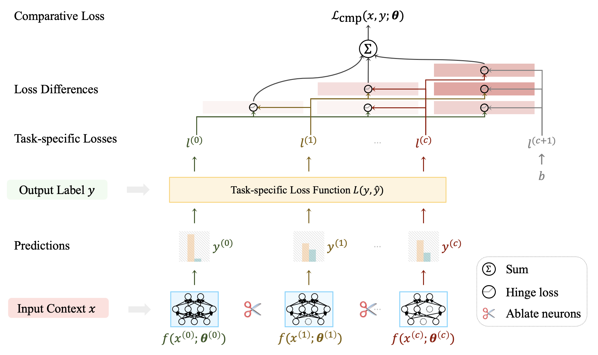
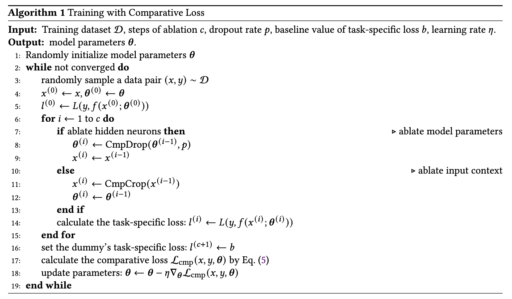

# Cross-Model Comparative Loss for Enhancing Neuronal Utility

This repository contains the code and processed data for the
paper "[Cross-Model Comparative Loss for Enhancing Neuronal Utility in Language Understanding](https://arxiv.org/pdf/2301.03765.pdf)".

Comparative loss is a simple task-agnostic loss function to improve neuronal utility without additional human
supervision.
It is essentially a pairwise ranking loss based on the comparison principle between the full model and its ablated
models, with the expectation that the less ablation there is, the smaller the task-specific loss.
It is theoretically applicable to all dropout-compatible models and tasks whose inputs contain irrelevant content.



```
@article{zhu2023cmp,
  title = {Cross-Model Comparative Loss for Enhancing Neuronal Utility in Language Understanding},
  author = {Zhu, Yunchang and Pang, Liang and Wu, Kangxi and Lan, Yanyan and Shen, Huawei and Cheng, Xueqi},
  year = {2023}
}
```

## Setup

Our experiments are conducted in the following environment with V100 (32 GB) GPUs.

```shell
conda create -n pt11 python=3.8
conda activate pt11
conda install -c conda-forge jupyterlab=3.4.5 tensorboard=2.10.0 ipywidgets=8.0.2
conda install pytorch==1.11.0 torchvision==0.12.0 torchaudio==0.11.0 cudatoolkit=11.3 -c pytorch
conda install -c conda-forge scikit-learn=1.1.1 scipy=1.8.1
conda install -c huggingface -c conda-forge tokenizers=0.12.1 datasets=2.1.0 transformers=4.19.2
pip install python-Levenshtein==0.20.8 matplotlib==3.6.2
# Unpack the large corpus file for HotpotQA
cd data/hotpot/ && tar -jxvf corpus.distractor.tsv.tar.bz2 && cd -
```

## Experiments

We have applied comparative loss on 14 datasets from 3 NLU tasks with distinct prediction types on top of 4 widely used
PLMs.
The tasks include:

1. Classification: [language understanding](https://github.com/zycdev/CmpLoss/blob/main/scripts/GLUE.md)
2. Extraction: reading comprehension
    - [Single-hop](https://github.com/zycdev/CmpLoss/blob/main/scripts/SQuAD.md)
    - [Multi-hop](https://github.com/zycdev/CmpLoss/blob/main/scripts/HotpotQA.md)
3. Ranking: [pseudo-relevance feedback](https://github.com/zycdev/LoL)

## DIY

If you want to train your models on other tasks with comparative loss, you can follow the algorithm below and refer
to `CmpQA`
in [modeling.py](https://github.com/zycdev/CmpLoss/blob/main/modeling.py#L197)
and [run_hotpot.py](https://github.com/zycdev/CmpLoss/blob/main/run_hotpot.py).



## Contact

For any questions about the paper or the code, please contact the first author or leave issues. 